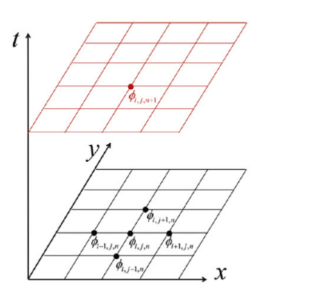
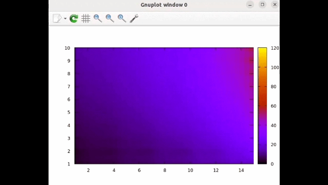

This C++ program is to  to solve the time-dependent heat conduction equation for a rectangular flat plate with the following boundary conditions:
  - the temperature is given at the bottom, the temperature profile is linear along the edge
  - the heat flow on the right is constant 
  - the thermal insulation along the other two edges is perfect.
The initial condition is linear in both Cartesian coordinates along the sheet, which also satisfies the boundary condition along the lower edge.

The program draws the simulation in real-time using the Gnuplot graphical tool. 


Figures \ref{first} and \ref{second} show the outcome of a simulation at different time points.
# The heat conduction equation
The observable fact in nature that heat flows from warmer areas to cooler ones can be expressed with the following mathematical equation:
```math
\boldsymbol{H} = - \kappa \nabla T(\boldsymbol{r}, t),\tag*{(1)}
```
where $\boldsymbol{H}$ is the heat flux, $\kappa$ is the thermal conductivity coefficient. The total amount of heat Q(t) in the material at a given time is proportional to the integral of the temperature over the entire substance:
```math
Q(t) =  \int d\boldsymbol{r} C \rho(\boldsymbol{r}) T(\boldsymbol{r}, t), \tag*{(2)}
```
where C is the specific heat capacity of the material, and $\rho$ is its density.
Since energy is a conserved quantity, the decrease in Q over time must be equal to the heat flowing out of the material. By applying energy balance and Gauss's theorem, we can derive the heat conduction equation:
```math
\frac{\partial T(\boldsymbol{r},t)}{\partial t} = \frac{\kappa}{C \rho} \nabla^2 T(\boldsymbol{r},t). \tag*{(3)}
```
I have been dealing with its two-dimensional form:
```math
\frac{\partial T(x,y,t)}{\partial t} = \frac{\kappa}{C \rho} \left( \frac{\partial^2 T(x,y,t)}{\partial x^2} + \frac{\partial^2 T(x,y,t)}{\partial y^2} \right). \tag*{(4)}
```
# Explicit Euler method


I conducted the simulation using the finite element method, so I discretized both space and time. In the equations, I indexed the examined time points with k, and the coordinates of the points in space with i and j indices for the x and y directions, respectively. The distance between spatial points is denoted by $\Delta x$ and $\Delta y$, and the time step is $\Delta t$.
To obtain the recursion formula used in the simulation, let's first write the first-order Taylor series expansion of $T_{i,j}^{n-1}$ around n:
```math
T_{i,j}^{n-1} = T_{i,j}^{n} - \Delta t \frac{\partial T}{\partial t} \Big\vert_{i,j}^n, \tag*{(4)}
```
thus
```math
\frac{\partial T}{\partial t} \Big\vert_{i,j}^n = \frac{T_{i,j}^{n} - T_{i,j}^{n-1}}{\Delta t}.\tag*{(5)}
```
In the next step, we write the second-order Taylor series expansion of $T_{i,j}^{n-1}$ and $T_{i+1,j}^{n-1}$ $T_{i-1,j}^{n-1}$:
```math
T_{i+1,j}^{n-1} = T_{i,j}^{n-1} + \Delta x \frac{\partial T}{\partial x} \Big\vert_{i,j}^{n-1} + \frac{\Delta x^2}{2!} \frac{\partial ^2 T}{\partial x^2} \Big\vert_{i,j}^{n-1} \tag*{(6)}
```
```math
T_{i-1,j}^{n-1} = T_{i,j}^{n-1} - \Delta x \frac{\partial T}{\partial x} \Big\vert_{i,j}^{n-1} + \frac{\Delta x^2}{2!} \frac{\partial ^2 T}{\partial x^2} \Big\vert_{i,j}^{n-1}. \tag*{(7)}
```
By adding equations the last two equations, and expressing the second derivative:
```math
 \frac{\partial ^2 T}{\partial x^2} \Big\vert_{i,j}^{n-1} = \frac{T_{i+1,j}^{n-1} + T_{i-1,j}^{n-1} - 2 T_{i,j}^{n-1}  }{\Delta x^2}. \tag*{(8)}
```
Let $\Delta x = \Delta y = h$ and substitute the obtained derivatives back into the heat conduction equation:
```math
\frac{T_{i,j}^{n} - T_{i,j}^{n-1}}{\Delta t} = \alpha \left( \frac{T_{i+1,j}^{n-1} + T_{i-1,j}^{n-1} - 4 T_{i,j}^{n-1} + T_{i,j+1}^{n-1} + T_{i,j-1}^{n-1}  }{h^2} \right). \tag*{(9)}
```
Expressing the single term taken at n:
```math
T_{i,j}^{n} = T_{i,j}^{n-1} + \alpha \frac{\Delta t}{h^2} (T_{i+1,j}^{n-1} + T_{i-1,j}^{n-1} - 4 T_{i,j}^{n-1} + T_{i,j+1}^{n-1} + T_{i,j-1}^{n-1} ), \tag*{(10)}
```
where $\alpha = \frac{\kappa}{C \rho}$.

 
 
I simulated the Dirichlet boundary condition on the bottom side of the rectangle by restoring the linear profile after each time step. For considering the Neumann boundary condition on the right side, I introduced a so-called ghost grid on that side. We take it into account during the calculation, but we do not display it.
In this case, the boundary condition is as follows:
```math
\frac{\partial T}{\partial x} \Big\vert_{0,j}^k = Q. \tag*{(11)}
```
To assess how closely our simulation approximates the analytical solution and to understand its efficiency, we can use the Neumann stability analysis method. This method is based on the assumption that the eigenmodes of the differential equation can be written in the following form:
```math 
T_{m}^j = \xi(k)^j e^{ikm \Delta x}, \tag*{(12)}
```
where $x=m \Delta x$ and $t=j \Delta t$. $\xi$ is the complex function of the wave number $k$. If the general solution of the differential equation can be expressed in terms of these eigenmodes, then the solution is stable if the eigenmodes are stable. An eigenmode is stable if the amplitude does not increase over time, that is, $|\xi(k)| < 1$ holds for all $k$.
To perform the stability analysis, we need to substitute the expression from (12) into equation (10):
```math
\xi^{j+1}e^{ikm \Delta x} = \xi^j e^{ikm \Delta x} + \eta \left( \xi^j e^{ik(m+1)\Delta x} + \xi^j e^{ik(m-1) \Delta x} - 2 \xi ^j e^{ikm \Delta x} \right). \tag*{(13)}
```
From this, utilizing the Euler formula:
```math
\xi (k) = 1+2 \eta \left( \cos{k \Delta x} - 1 \right). \tag*{(14)}
```
So that $|\xi (k)| < 1$ holds for all $k$:
```math
\eta = \frac{\kappa \Delta t}{C \rho \Delta x^2} < \frac{1}{2}. \tag*{(15)}
```
Based on this equation, choosing smaller time steps $\Delta t$ leads to a more stable solution. However, if we decrease the spatial step size $\Delta x$ without quadratically adjusting the time step in proportion, the stability will decrease. We could perform this calculation considering only $\Delta x$ because in the simulation, we use the same step size in both spatial directions. This is not ideal for highly elongated rectangles, but it greatly simplifies the computation and the simulation.

# Example run

An example of the program settings:
h = 0.0625
dt = 0.00001
$\alpha$ = 1
Based on these, $\eta = 0.00256$, which is evidently within the stable region.

With these settings the result:




