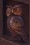
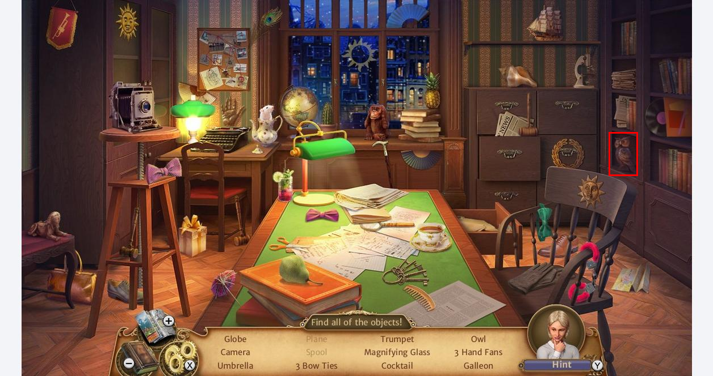

This program is to search an image in a bigger one.

To read and create png files the open-source stb library has been used which can be accessed here:
https://github.com/nothings/stb/tree/master

This library is easy to distribute and deploy because all the code is contained in a single file.

The program is impelemented also in basic C++ (main.cpp) and using CUDA toolkit (main.cu).

The image I tested on:

 

 The small image of the owl the program is searching for:
 
 

 The result png image what the program creates:

 
 
